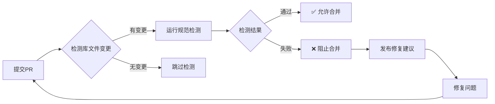

# 📋 Blockly库规范自动检测系统

本系统通过GitHub Actions自动检测Arduino Blockly库的规范合规性，确保代码质量和一致性。

## 🚀 功能特性

### 自动检测触发
- **Pull Request**: 当PR修改库文件时自动运行检测
- **Push提交**: 当推送到main/develop分支时运行检测  
- **文件监控**: 监控 `package.json`, `block.json`, `generator.js`, `toolbox.json`, `readme.md` 文件变更

### 检测范围
- ✅ **文件结构检测** - 必需文件完整性
- ✅ **package.json规范** - 版本、依赖、兼容性配置
- ✅ **block.json设计** - 块定义、字段类型、连接规则
- ✅ **generator.js实现** - 代码生成质量、最佳实践
- ✅ **toolbox.json配置** - 工具箱结构、影子块设置
- ✅ **README文档** - 文档完整性、规范格式

### 智能报告
- 📊 **详细分数**: 每个类别的具体得分和总分
- 🔧 **修复建议**: 针对每个问题提供具体的修复指导
- 📝 **GitHub摘要**: 在Actions页面生成美观的检测报告
- 💬 **PR评论**: 自动在PR中发布检测结果

## 📁 文件说明

```
.github/
├── workflows/
│   └── library-compliance-check.yml    # 主要的GitHub Actions工作流
├── compliance-config.yml               # 检测规则配置文件
└── README.md                          # 本文档

validate-library-compliance.js          # 核心检测脚本
github-actions-validator.js             # GitHub Actions优化版本
```

## 🔧 本地使用

### 基础用法
```bash
# 检测单个库
node validate-library-compliance.js 74HC595

# 检测多个库  
node validate-library-compliance.js DHT FastLED servo

# 检测所有库
node validate-library-compliance.js --all
```

### GitHub Actions模式
```bash
# 检测Git变更的库
node github-actions-validator.js --changed

# 检测指定库（GitHub Actions优化）
node github-actions-validator.js 74HC595 DHT
```

## 📊 评分标准

| 检测项目 | 满分 | 权重 |
|---------|------|------|
| 文件结构 | 10 | 基础框架完整性 |
| package.json | 15 | 项目配置规范 |  
| block.json | 20 | 积木设计质量 |
| generator.js | 25 | 代码生成实现 |
| toolbox.json | 10 | 工具箱配置 |
| README文档 | 20 | 文档完整性 |
| **总计** | **100** | |

### 通过标准
- 🟢 **优秀** (90-100分): 完全符合规范
- 🟡 **良好** (80-89分): 基本符合规范，有改进空间
- 🔴 **需要改进** (<80分): 存在重要问题，需要修复

## 🔄 工作流程

### Pull Request流程


### 检测触发条件
1. **文件变更检测**: 只检测实际修改的库
2. **智能差异分析**: 比较PR分支与目标分支的差异
3. **增量检测**: 避免重复检测未变更的库

## ⚙️ 配置选项

### 工作流配置 (`.github/workflows/library-compliance-check.yml`)

```yaml
# 触发条件
on:
  pull_request:
    branches: [ main, develop ]
    paths: [ '*/package.json', '*/block.json', ... ]
  
# 检测环境
jobs:
  validate-libraries:
    runs-on: ubuntu-latest
    steps:
      - uses: actions/checkout@v4
      - uses: actions/setup-node@v4
```

### 检测规则配置 (`.github/compliance-config.yml`)

```yaml
compliance:
  scoring:
    file_structure: 10
    package_json: 15
    # ...其他配置
  
  strictness:
    missing_readme: warning
    poor_generator_practices: error
```

## 🐛 问题排查

### 常见问题

1. **检测脚本找不到库**
   ```bash
   ❌ 库目录不存在: mylib
   ```
   - 确保库目录名称正确
   - 检查是否包含 `package.json` 文件

2. **GitHub Actions权限问题**
   ```yaml
   # 确保workflow有正确权限
   permissions:
     contents: read
     issues: write
     pull-requests: write
   ```

3. **Node.js版本兼容性**
   - 要求 Node.js >= 14
   - 使用 `actions/setup-node@v4` 确保版本一致

### 调试模式

```bash
# 启用详细日志
DEBUG=1 node validate-library-compliance.js mylib

# GitHub Actions调试
# 在工作流中添加:
- name: Debug
  run: |
    echo "GITHUB_EVENT_NAME: $GITHUB_EVENT_NAME"
    echo "Changed files: $CHANGED_FILES"
```

## 📈 最佳实践

### 库开发者
1. **提交前本地检测**: 在提交PR前运行本地检测
2. **增量改进**: 逐步提高库的规范得分
3. **参考标准**: 查看高分库的实现方式

### 维护者
1. **设置分支保护**: 要求检测通过才能合并
2. **定期全量检测**: 定期运行 `--all` 模式检查所有库
3. **规范更新**: 根据检测结果持续改进规范

## 🔗 相关资源

- 📖 [Arduino库转Blockly库规范](./Arduino库转Blockly库规范.md)
- 📋 [Blockly库README编写规范](./blockly库readme编写规范.md)
- 🏗️ [库开发指南](./库开发.md)
- 🎯 [最佳实践示例](./adafruit_DHT/) - 参考DHT库实现

## 🤝 贡献指南

欢迎贡献改进检测规则和修复建议：

1. Fork 项目
2. 创建功能分支
3. 提交改进的检测规则
4. 发起Pull Request

检测脚本本身也会通过规范检测，确保代码质量！