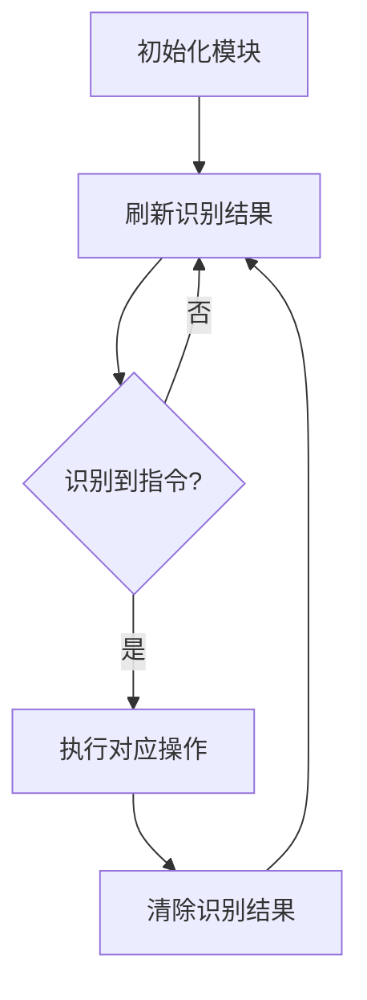

# SU-03T语音识别模块库

## 概述

SU-03T语音识别模块库为Aily Blockly提供语音识别和语音播报功能。该库支持通过串口与SU-03T模块通信，实现语音指令识别和语音合成播报。

## 功能特性

- **语音识别**: 支持56种预定义语音指令识别
- **语音播报**: 支持整数、小数和预定义文本播报
- **串口通信**: 支持软串口和硬串口两种连接方式
- **实时处理**: 支持实时刷新识别结果

## 硬件连接

### 软串口连接
- SU-03T RX → Arduino TX (数字引脚)
- SU-03T TX → Arduino RX (数字引脚)

### 硬串口连接
- SU-03T RX → Arduino Serial2 TX
- SU-03T TX → Arduino Serial2 RX

## 使用方法

### 1. 初始化模块
首先需要初始化SU-03T语音识别模块，选择连接方式并设置引脚。

### 2. 语音识别流程


### 3. 语音播报
支持三种播报方式：
- 播报整数数值
- 播报小数数值  
- 播报预定义文本

## 预定义语音指令

### 控制类指令
- 开灯 (1)、关灯 (2)
- 打开空调 (7)、关闭空调 (8)
- 打开风扇 (9)、关闭风扇 (16)
- 1档风 (17)、2档风 (18)、3档风 (19)

### 模式设置
- 自动模式 (20)、制冷模式 (21)、制热模式 (22)
- 调为红色 (3)、调为蓝色 (4)、调为绿色 (5)、调为彩色 (6)

### 数值调节
- 升高温度 (23)、降低温度 (24)
- 调到最亮 (33)、调到最暗 (34)
- 调亮一点 (35)、调暗一点 (36)

### 查询功能
- 查询温度 (37)、查询湿度 (38)、查询天气 (39)
- 查询时间 (51)

### 运动控制
- 前进 (40)、后退 (41)、左转 (48)、右转 (49)、停止 (50)

### 音乐控制
- 播放音乐 (52)、上一首 (53)、下一首 (54)
- 开始 (55)、暂停 (56)

## 预定义播报文本

### 数值相关
- 现在的温度是 (1)、度 (2)、现在的湿度是百分之 (3)
- 一 (4) 到 十 (13)、个 (14) 到 亿 (18)、点 (19)、负 (20)、零 (21)

### 时间相关
- 现在的时间是 (22)、年 (23)、月 (24)、日 (25)
- 点 (26)、分 (27)、秒 (28)

### 单位和前缀
- 百分之 (29)、现在的距离是 (30)
- 毫米 (31)、厘米 (32)、米 (33)、千米 (34)

## 技术规格

- **通信接口**: UART串口通信
- **波特率**: 9600 bps
- **数据格式**: 8N1
- **通信协议**: 自定义协议 (0xAA55开头，0x55AA结尾)
- **工作电压**: 3.3V/5V

## 兼容性

支持以下Arduino开发板：
- Arduino UNO/Nano/Pro Mini (AVR)
- Arduino Mega (AVR)
- Arduino MKR系列/Zero (SAMD)
- ESP32/ESP8266
- Arduino UNO R4 WiFi
- Raspberry Pi Pico

## 注意事项

1. **引脚配置**: 确保RX/TX引脚连接正确
2. **波特率**: 模块默认波特率为9600，请勿修改
3. **电源**: 确保模块供电稳定
4. **刷新频率**: 建议在loop中持续刷新识别结果
5. **指令清除**: 处理完指令后记得清除识别结果

## 示例代码

### 基础语音控制
```cpp
// 初始化
初始化SU-03T语音识别模块 软串口 RX为 2 TX为 3

// 主循环
循环 {
  刷新语音识别结果 软串口
  
  如果 识别到指令 开灯 指令 {
    digitalWrite(13, HIGH);
    清除语音识别结果;
  }
  
  如果 识别到指令 关灯 指令 {
    digitalWrite(13, LOW);
    清除语音识别结果;
  }
}
```

### 语音播报示例
```cpp
// 播报温度
播报 "现在的温度是";
播报整数 25;
播报 "度";

// 播报湿度
播报 "现在的湿度是百分之";
播报整数 65;
```

## 故障排除

### 无法识别语音
1. 检查硬件连接
2. 确认模块供电正常
3. 检查串口波特率设置

### 播报无声音
1. 检查模块扬声器连接
2. 确认播报指令格式正确
3. 检查串口通信是否正常

### 识别结果不准确
1. 确保环境安静
2. 语音清晰标准
3. 适当调整模块位置

## 版本历史

- **v1.1.0**: 初始版本，支持基础语音识别和播报功能

## 许可证

本库基于MIT许可证开源。